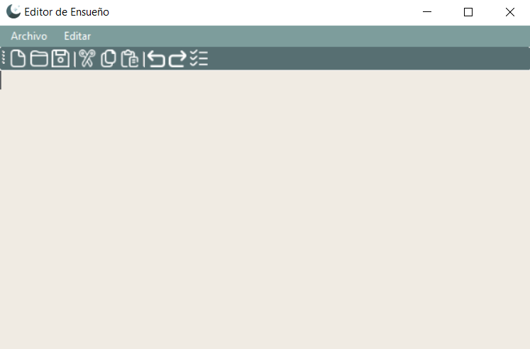
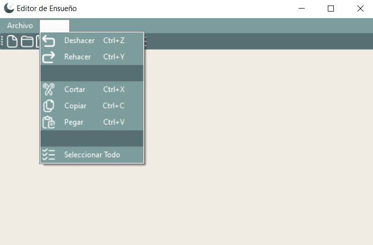

# Dream Editor - Bilingual

---

¡Saludos!


Por aquí, les dejo otro proyecto bastante interesante, el cual he llamado Editor de ensueño, pero debemos ser realistas, solo es una simple editor de texto.


Greetings!


Now, i bring you other project really interesting, i called it Dream Editor but we need to have our foots in the earth, it's a simple text editor.





---


### Características:


En realidad las características que engloban esta simple aplicación son las siguientes:


- Escribir y alterar texto plano.
  
  - Deshacer, hacer, seleccionar todo
  
  - Cortar, pegar y aún, guardar funcional

- Atajos para cada cosa.

- Íconos personalizados


### Characteristics:


Ok, so, the characteristics that surrond our application are:

- Write and update plain text
  
  - Undo, redo and select all in it.
  
  - Cut, paste, and save an archive

- Keyboard shortcut for a while.

- Custon icons





---

### Tecnologías usadas:

Las tecnologías usadas en este proyecto, y que lo hicieron posible son:

```cs
string[] tecnologías = {"C#"}
```

### 

### Used Technologies:

Here, i put the technologes that i used to bring to live this project:

```js
const tecnologies = ["C#"]
```

---

### Pie de documentación:

> Desarrollado por On3l7d15h.


### Documentation footer:

> Developed By On3l7d15h.
